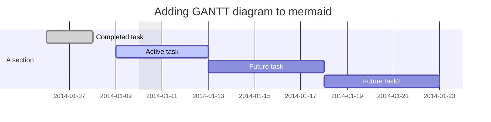
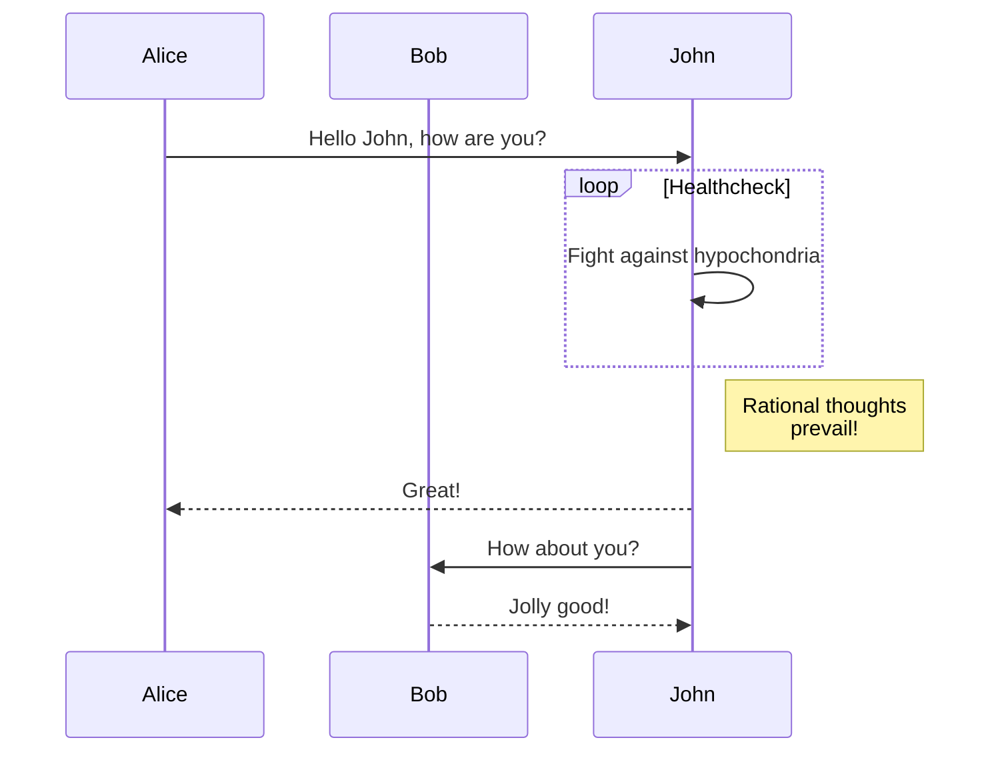
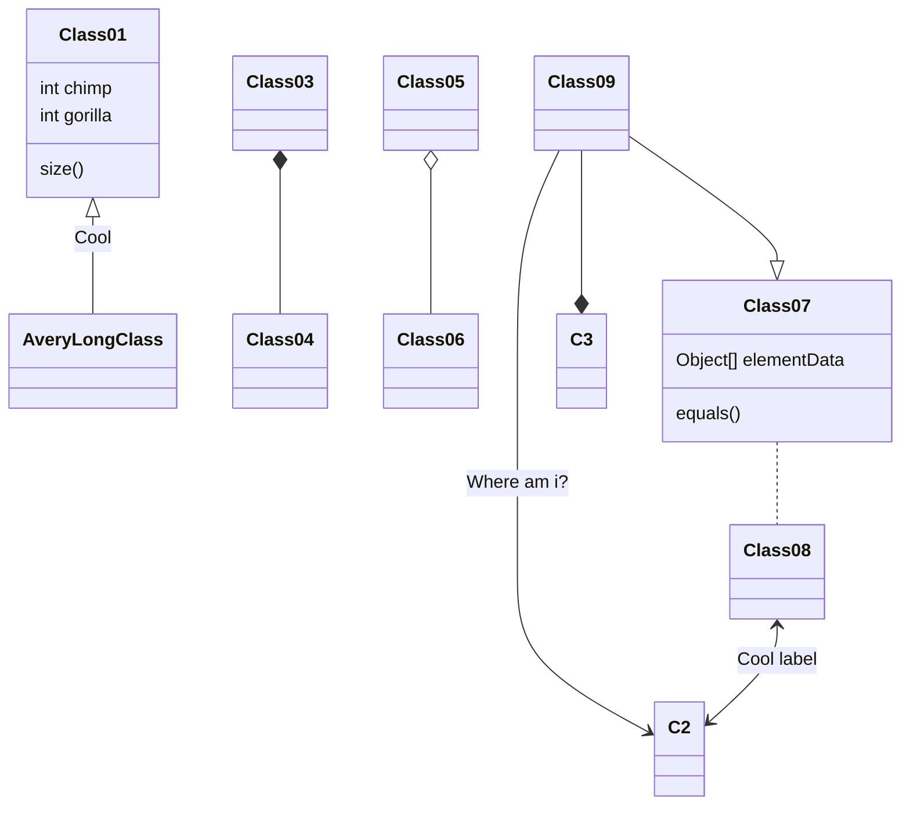

<title> Markdown to PDF sample by md-to-pdf-ng </title>

# Markdown To Pdf

## 1. Images


## 2. Typography

### 2.1. Paragraph

**Lorem ipsum** dolor sit amet consectetur adipisicing elit. Quisquam, itaque ~~error vero~~ eius perferendis [googlum](https://google.com) iusto voluptas, eum saepe quae nemo et ab, nostrum debitis sequi quas. _Est eum officia praesentium._

### 2.2. Lists

#### 2.2.1. Unordered

* foo
* bar

#### 2.2.2. Ordered

1. foo
1. bar

### 2.3. Blockquote

> Lorem ipsum dolor sit amet consectetur adipisicing elit. Quisquam, itaque error vero eius perferendis iusto voluptas, eum saepe quae nemo et ab, nostrum debitis sequi quas. Est eum officia praesentium.

## 3. Tables

| Key | Value |
| --- | ----- |
| foo | bar   |
| bar | foo   |

## 4. Highlighted Code

```js
const foo = 'bar';
console.log(foo === 'bar'); // => true

const longString = 'Lorem ipsum dolor sit amet consectetur adipisicing elit. Quisquam, itaque error vero eius perferendis iusto voluptas, eum saepe quae nemo et ab, nostrum debitis sequi quas. Est eum officia praesentium.';
```

## 5. Long Paragraph

Cross-reference to [Yay](#6-yay).

Lorem ipsum dolor sit amet consectetur adipisicing elit. Maxime eos, fugit totam laboriosam harum earum cupiditate corporis, facilis nulla dolor hic consequatur. Magnam maiores unde aut esse est perferendis quos. Lorem ipsum dolor sit amet consectetur adipisicing elit. Aspernatur nobis laudantium iste repudiandae! Iusto, voluptas. Suscipit, iure autem! Fugiat, enim? Placeat quisquam optio reiciendis similique et ex voluptatum labore sit?

## 6. Yay

Lorem ipsum dolor sit amet consectetur adipisicing elit. Maxime eos, fugit totam laboriosam harum earum cupiditate corporis, facilis nulla dolor hic consequatur. Magnam maiores unde aut esse est perferendis quos.

## 7. mermaid






<!-- Water mark example: -->
<div style="position: fixed; display: flex; alignItems: center; top: 45%; left: 1%; height: 96px; font-size: 96px; opacity: 10%; transform: rotate(-45deg);">
    
    <span style="line-height: 96px; margin-left: 15px"> Watermark </span>
</div>
